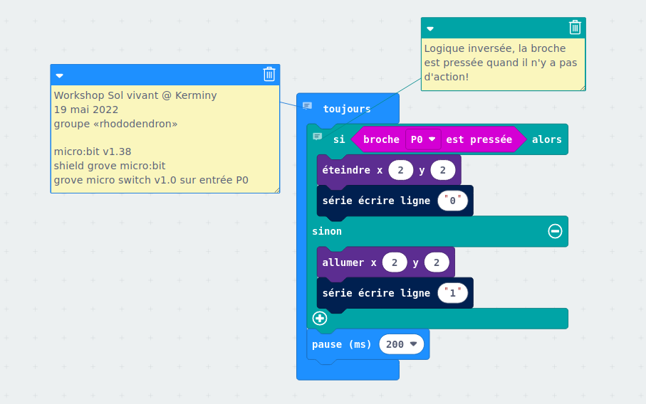
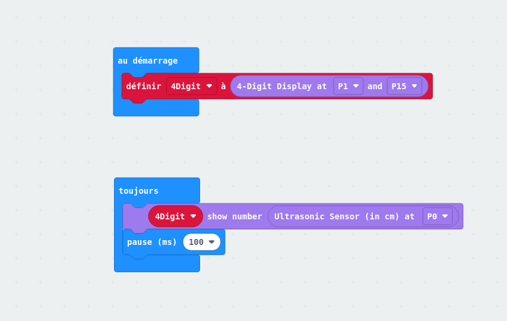
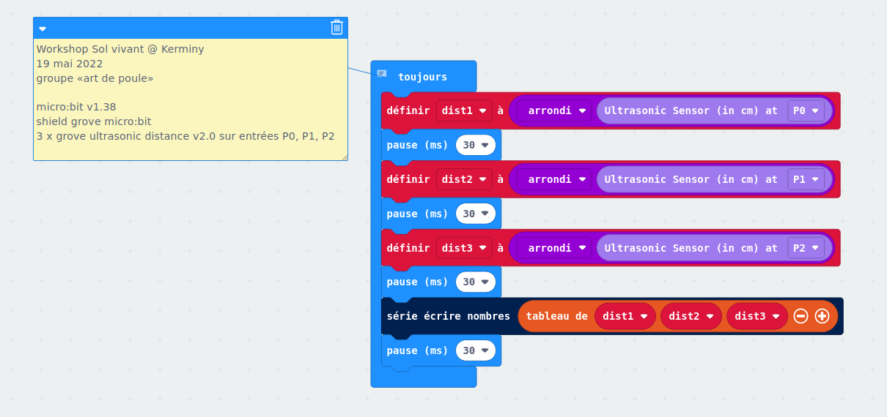

# microbit utile

## En utilisant makecode / blocks

Éditeur : https://makecode.microbit.org/#editor

Préparer le programme, télécharger le format hex compilé, brancher la carte micro:bit par USB et copier le fichier hex dans le dossier MICROBIT

(Pour ajouter un commentaire dans makecode / blocks, clic droit sur un bloc)

## Petits programmes divers

Pour utiliser le *shield* grove dans makecode / blocks, choisir «avancé» dans le menu, puis «extensions» et chercher «grove».

**grove_switch_serie_processing**  
Avec le *shield* grove, captation d'un switch, envoie de données à processing, déclenchement de son en fonction.

**grove_distance_ultrason_4digits**  
Avec le *shield* grove, captation de distance par ultrason, affichage sur un écran 4 digits

**grove_3xdistance_ultrason_serie**  
Avec le *shield* grove, 3 capteurs de distance à ultrason, un seul message série envoyé vers processing.

**[datalogging_microbit_v2](./datalogging_microbit_v2)**  
Un exemple avec la carte micro:bit version 2 qui peut conserver des données dans la mémoire persistante.
