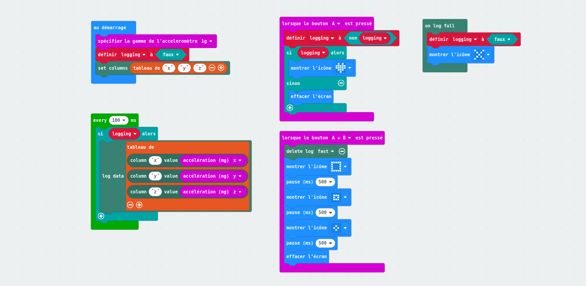

# Datalogging avec Microbit V2

La version 2 de la carte micro:bit permet d'enregistrer des données directement dans la mémoire persistante de la carte depuis n'importe quelle broche ou capteur intégré. Pour accéder aux données, on peut connecter le micro:bit à un ordinateur et ouvrir le fichier MY_DATA.HTM dans un navigateur. Les données sont exportables en CSV.

Le fichier MY_DATA.HTM est mis à jour à chaque fois que le micro:bit est physiquement débtanché puis rebranché...

## Datalogging de l'accéléromètre

On peut utiliser makecode en programmation par bloc avec cette base (ici pour loguer les valeurs x, y, z de l'accéléromètre).

**Code**

Dans extensions, chercher «*datalogger*» pour importer les blocs.

L'équivalent est possible dans makecode en python ou javascript (cf. code dans ce dossier)

source : https://microbit.org/get-started/user-guide/data-logging/

## Questions ?

**Quelle capacité de stockage ?**

«*This can depend on the amount of data being logged concurrently. For example, logging data every 100ms with 1 column of data you might expect ~11,000 entries, and with 2 columns of data ~6000 entries. If the log is full, you will see an error on your device*» ([source](https://support.microbit.org/support/solutions/articles/19000129031-data-logging-faq))

**Durée maximale de logging**

En fonction de la quantité de données stockées. Par exemple, avec les informations précédentes : 1 donnée loguée, 11000 informations à raison de 10 par secondes, cela donne un peu plus de 18 minutes.

**Comment effacer complètement les données**

En reflashant un nouveau microprogramme (les données sont stockées dans un espace mémoire de la puce USB).
